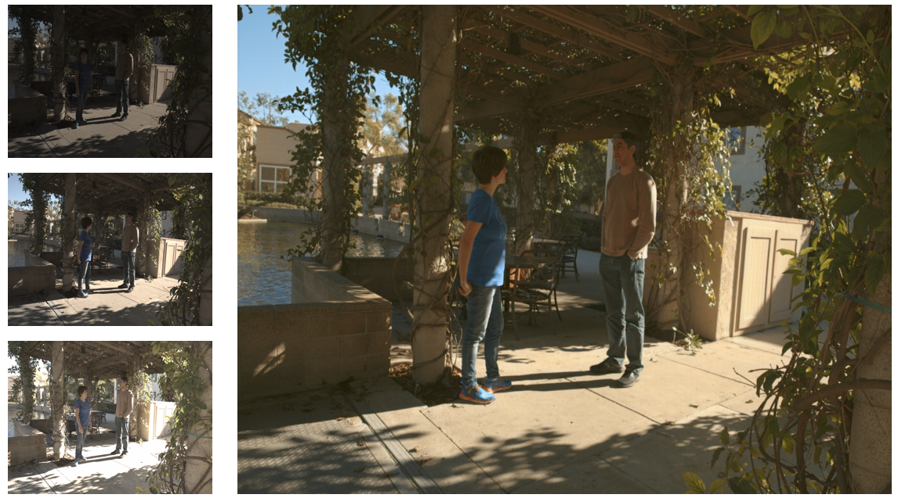
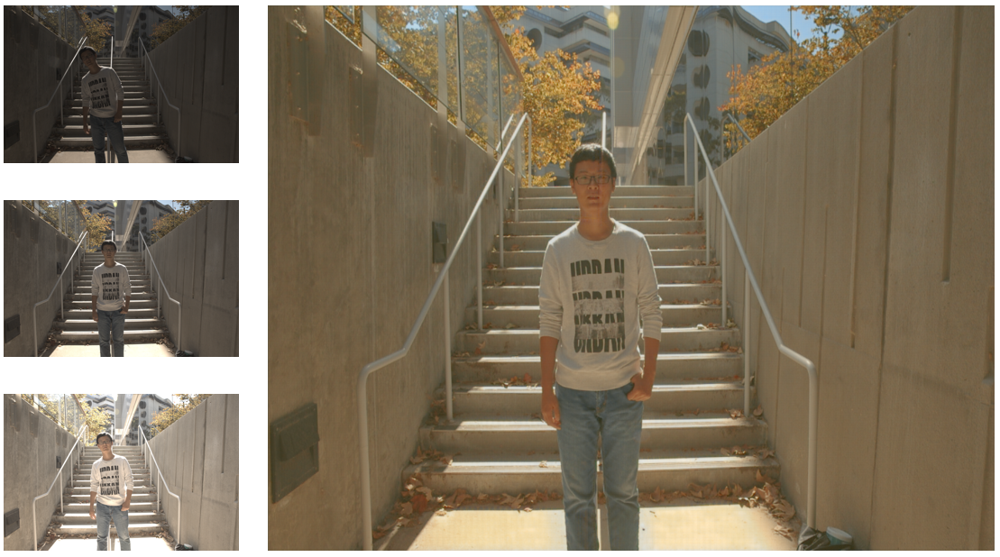
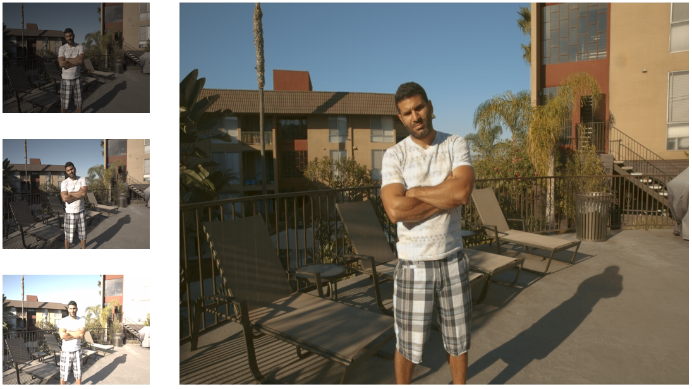

# Deep HDR Imaging
The Keras Implementation of the [Deep HDR Imaging via A Non-Local Network](https://ieeexplore.ieee.org/document/8989959) - TIP 2020
## Content
- [Deep-HDR-Imaging](#deep-hdr-imaging)
- [Getting Started](#getting-tarted)
- [Running](#running)
- [References](#references)
- [Citations](#citation)

## Getting Started

- Clone the repository

### Prerequisites

- Tensorflow 2.2.0+
- Tensorflow_addons
- Python 3.6+
- Keras 2.3.0
- PIL
- numpy

```python
pip install -r requirements.txt
```

## Running
### Training 
- Preprocess
    - Download the [training data](https://cseweb.ucsd.edu/~viscomp/projects/SIG17HDR/PaperData/SIGGRAPH17_HDR_Trainingset.zip) and [testing data](https://cseweb.ucsd.edu/~viscomp/projects/SIG17HDR/PaperData/SIGGRAPH17_HDR_Testset.zip).

    - Run this file to generate data. (Please remember to change path first)

    ```
    python src/create_dataset.py
    ```

- Train NHDRRNet 
    ```
    python main.py
    ```

- Test ZERO_DCE
    ```
    python test.py
    ```
## Usage
### Training
```
usage: main.py [-h] [--images_path IMAGES_PATH] [--test_path TEST_PATH]
               [--lr LR] [--gpu GPU] [--num_epochs NUM_EPOCHS] 
               [--train_batch_size TRAIN_BATCH_SIZE]
               [--display_ep DISPLAY_EP] [--checkpoint_ep CHECKPOINT_EP]
               [--checkpoints_folder CHECKPOINTS_FOLDER]
               [--load_pretrain LOAD_PRETRAIN] [--pretrain_dir PRETRAIN_DIR]
               [--filter FILTER] [--kernel KERNEL]
               [--encoder_kernel ENCODER_KERNEL]
               [--decoder_kernel DECODER_KERNEL]
               [--triple_pass_filter TRIPLE_PASS_FILTER]
```

```
optional arguments: -h, --help                show this help message and exit
                    --images_path             training path
                    --lr                      LR
                    --gpu                     GPU
                    --num_epochs              NUM of EPOCHS
                    --train_batch_size        training batch size
                    --display_ep              display result every "x" epoch
                    --checkpoint_ep           save weights every "x" epoch
                    --checkpoints_folder      folder to save weight
                    --load_pretrain           load pretrained model
                    --pretrain_dir            pretrained model folder
                    --filter                  default filter
                    --kernel                  default kernel
                    --encoder_kernel          encoder filter size
                    --decoder_kernel          decoder filter size
                    --triple_pass_filter      number of filter in triple pass
```

### Testing
Download the weight [here](https://drive.google.com/file/d/1OjJYirwRa8cLGzzdRYRkjq_1FokyI80V/view?usp=sharing) and put it to the folder.
```
usage: test.py [-h] [--test_path TEST_PATH] [--gpu GPU]
                    [--weight_test_path WEIGHT_TEST_PATH] [--filter FILTER]
                    [--kernel KERNEL] [--encoder_kernel ENCODER_KERNEL]
                    [--decoder_kernel DECODER_KERNEL]
                    [--triple_pass_filter TRIPLE_PASS_FILTER]
```
```
optional arguments: -h, --help                    show this help message and exit
                    --test_path                   test path
                    --weight_test_path            weight test path
                    --filter                      default filter
                    --kernel                      default kernel
                    --encoder_kernel              encoder filter size
                    --decoder_kernel              decoder filter size
                    --triple_pass_filter          number of filter in triple pass
```

#### Result
 
 
 

## License

This project is licensed under the MIT License - see the [LICENSE](https://github.com/tuvovan/NHDRRNet/blob/master/LICENSE) file for details

## References
[1] Deep HDR Imaging via A Non-Local Network - TIP 2020 [link](https://ieeexplore.ieee.org/document/8989959)

[3] Training and Testing dataset - [link](https://cseweb.ucsd.edu/~viscomp/projects/SIG17HDR/)

## Citation
```
    @ARTICLE{8989959,  author={Q. Yan and L. Zhang and Y. Liu and Y. Zhu and J. Sun and Q. Shi and Y. Zhang},  
    journal={IEEE Transactions on Image Processing},   
    title={Deep HDR Imaging via A Non-Local Network},   
    year={2020},  
    volume={29},  
    number={},  
    pages={4308-4322},}
```
## Acknowledgments
- This work based on the paper mentioned above with few modification:
    - the fixed size of the adaptive average pooling (16 instead of 32 as assigned in the paper)
    - the number of triple pass module is defined as 10 to match the number of 32M as stated in the paper.
- Any ideas on updating or misunderstanding, please send me an email: <vovantu.hust@gmail.com>
- If you find this repo helpful, kindly give me a star.

